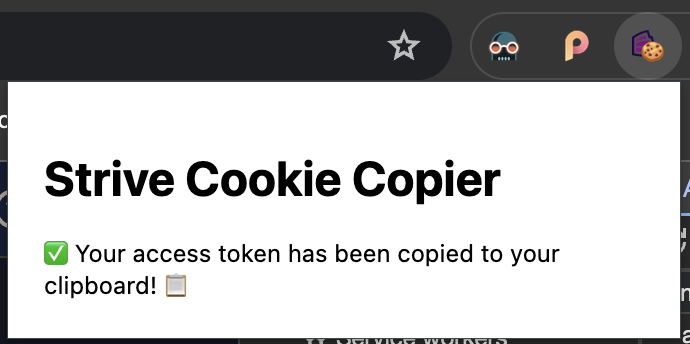

## Strive Cookie Copier
This very simple extension can be added to your Chrome profile to simply copy your Striveworks `access_token` to your clipboard.

### Installing
In leiu of publishing the Chrome Web Store, you can:
1. `git clone github.com/peter-crist/cookiecopier`
2. Navigate to `chrome://extensions/` in your browser
3. Click the toggle to enable **Developer mode**
4. Select "Load unpacked"
5. When selecting the extension directory, use the root directory for the cloned repo.

The extension should now be installed and for ease-of-use, you should pin the extension. 

### How do I use it?
On a Chariot domain, simply click the extension button. If the `access_token` is found, it will have been copied to your clipboard. 

